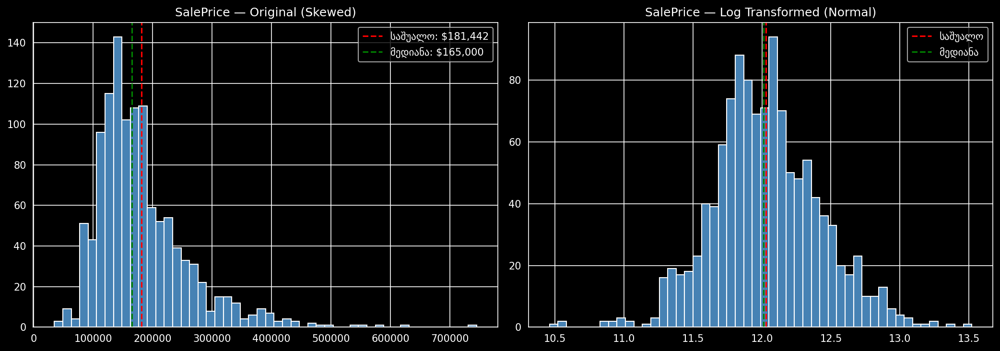
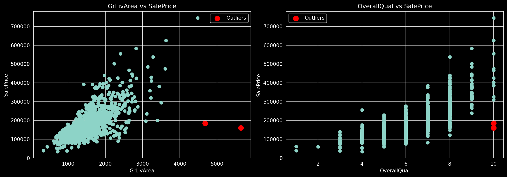
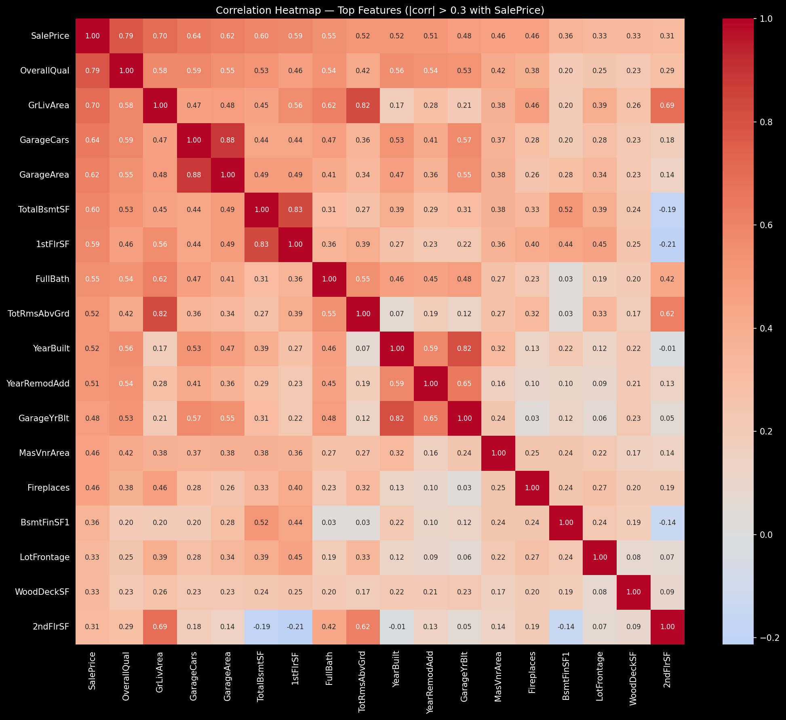
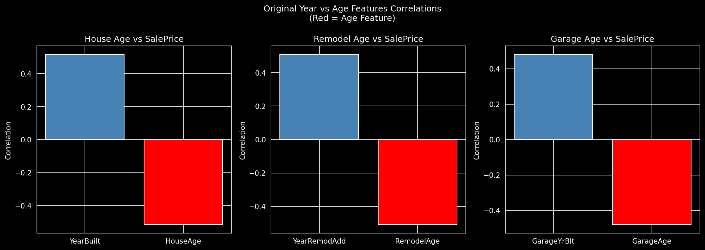
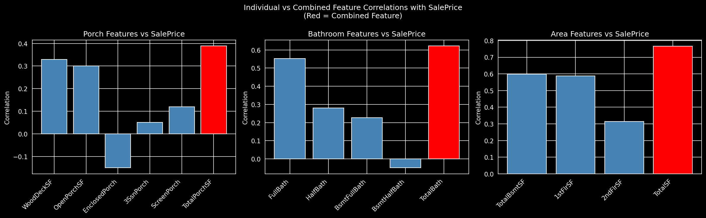
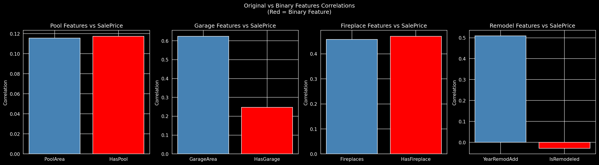
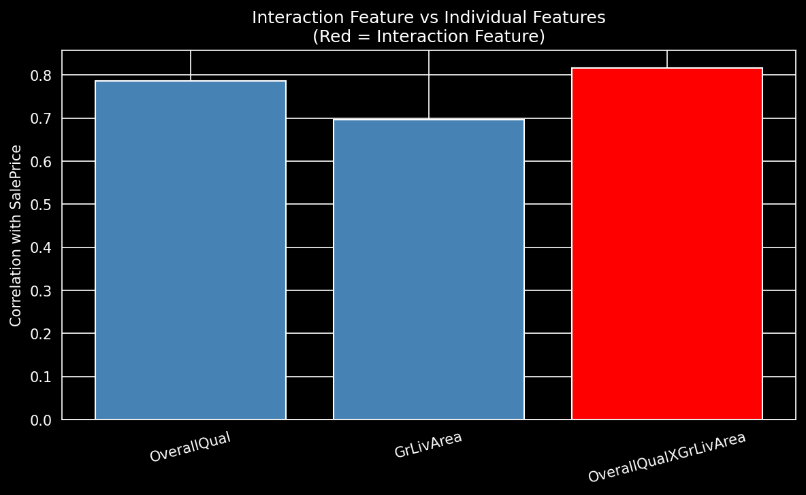
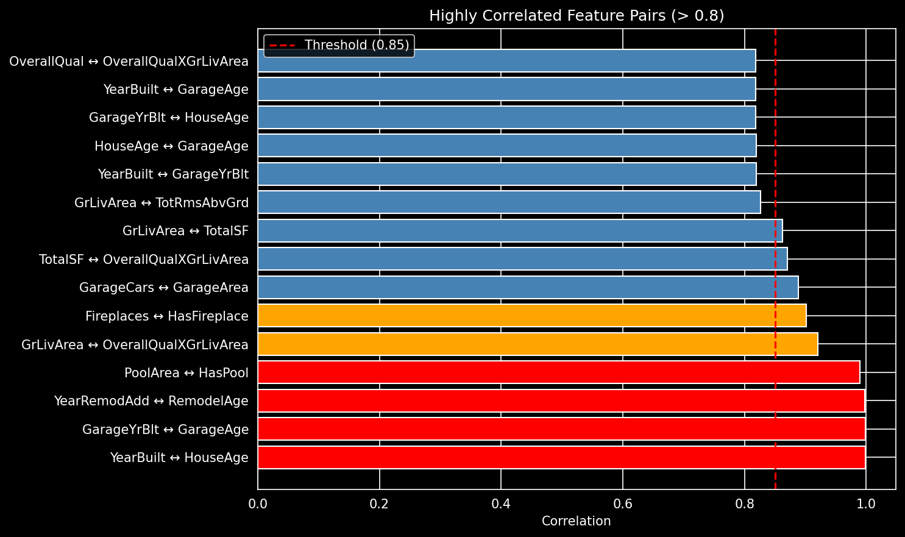

# House Prices - Advanced Regression Techniques

## პროექტის მოკლე აღწერა
ეს პროექტი არის supervised learning-ის ერთ-ერთი მაგალითი, რომელშიც ჩვენი მიზანია ბინების ფასის პროგნოზს.
პრობლემა წარმოადგენს რეგრესიის ამოცანას.

### შეფასების მეტრიკა
მოდელი ფასდება **RMSLE** (Root Mean Squared Log Error)-ით:
- გამოითვლება RMSE პროგნოზისა და რეალური ფასის ლოგარითმებს შორის.
- იაფი და ძვირი სახლების error თანაბრად აისახება შედეგზე.
- ამიტომ SalePrice-ს log transform ვაკეთებ სატრენინგოდ, ხოლო პროგნოზის დროს უკან დავაბრუნებ.

## ჩემი მიდგომა
პრობლემის გადასაჭრელად გამოვიყენე შემდეგი pipeline:
1. **EDA** - მონაცემების შესწავლა და პრობლემების იდენტიფიცირება
2. **Data Cleaning** - outlier-ების ამოღება, missing values დამუშავება, კატეგორიული ცვლადების encoding
3. **Feature Engineering** - ახალი ინფორმაციული ცვლადების შექმნა
4. **Feature Selection** - უსარგებლო ცვლადების ამოღება
5. **Model Training** - baseline მოდელებიდან advanced მოდელებამდე +HPO (Hyperparameter Optimization)

## რეპოზიტორიის სტრუქტურა
```
House-Prices/
├── images/                      # გრაფიკები README-თვის
├── model_experiment.ipynb       # მთავარი სამუშაო ფაილი მოდელის დასატრენინგებლად
├── model_inference.ipynb        # საბოლოო პროგნოზი და submission
└── README.md                    # პროექტის დოკუმენტაცია
```

## მონაცემების დაყოფა
სანამ რამეს შევხედავთ, მონაცემები დავყოთ Train და Test-ად, რათა თავიდან ავირიდოთ
**data leakage** - ანუ სიტუაცია, სადაც მონაცემებს შევხედავთ და ამას შეიძლება გავლენა ჰქონდეს ჩვენ მიერ შერჩეულ დაყოფის სტრატეგიაზე.
test_df-ს შევეხებით მხოლოდ ბოლოს, საბოლოო შეფასებისათვის, რაც მოგვცემს სანდო შეფასებას.

## Exploratory Data Analysis (EDA)
Kaggle Competition-ის Overview-ში EDA-ს შესახებ რჩევები წერია.
ამის გათვალისწინებით შევისწავლე შემდეგი მონაცემები:
- მონაცემების სტრუქტურა
- missing values
- target (SalePrice) განაწილება
- კორელაცია target-თან
- Outliers

### მონაცემების სტრუქტურა
- train_df-ს აქვს 1168 სტრიქონი და 81 სვეტი.
- 43 numerical სვეტი, 38 categorical სვეტი.

### Missing values
- `data_description.txt` ფაილიდან, რომელშიც წერია მონაცემებზე ყველაფერი, ვიგებთ, რომ NaN ხანდახან ნიშნავს **"არ აქვს"** და არა აუცილებლად იმას, რომ **"მონაცემი აკლია"**.
- **PoolQC (99.49%), MiscFeature (96.06%), Alley (93.66%), Fence (80.05%), FireplaceQu (46.83%)** - ამ მონაცემებისთვის NaN ნიშნავს **"არ აქვს"**.
- **LotFrontage (18.58%)** - ამ სვეტისთვის NaN ნიშნავს **"მონაცემი აკლია"**.

### Target (SalePrice) განაწილება


**აღმოჩენები:**
- სახლების უმრავლესობა 100-200K (62.2%) და 200-300K (22.4%) რეინჯშია.
- საშუალო უფრო დიდია ვიდრე მედიანა, რაც ნიშნავს, რომ რამდენიმე ძვირიანი სახლი საშუალოს ზრდის.
- ეს იწვევს right skew-ს, ანუ საშუალოსგან მარჯვნივ არის მონაცემები გადახრილი ამის გამო
- Skewness გვაქვს 1.74, რაც პრობლემურად ითვლება.
- 500K+ სახლი მხოლოდ 6 ცალია (0.5%), ხოლო 700K+ 1 ცალი (0.1%) - ესენი შესაძლო outlier-ები არიან.

**რატომ Log Transform:**
- Log Transform-ის შემდეგ skewness 1.74-დან 0.12-მდე იკლებს - ემსგავსება სიმეტრიულ განაწილებას.
- საშუალო და მედიანა თითქმის ემთხვევა, განაწილება სიმეტრიულია.
- Linear Regression ვარაუდობს რომ შეცდომები ნორმალურად არის განაწილებული.
- Skewed target-ით რამდენიმე ძვირიანი სახლი დიდ შეცდომებს მოგვცემს, რაც მოდელს დააბნევს. 
  Log Transform ამ შეცდომებს პატარასა და სიმეტრიულს ხდის.

### კორელაცია target-თან
ყველაზე მაღალი დადებითი კორელაცია:
- **OverallQual (0.79)** - თუ სახლის ზოგადი ხარისხი მაღალია, ფასიც მაღალია.
- **GrLivArea (0.70)** - დიდი ფართობი ნიშნავს დიდ ფასს.
- **GarageCars (0.64)** - რაც უფრო მეტი მანქანა ეტევა გარაჟში, მეტია სახლის ფასი.

უარყოფითი კორელაციები მაქსიმუმ -0.15-ს აღწევს, რაც საკმაოდ სუსტია (-1 იქნებოდა სრული უარყოფითი კავშირი).
ეს ნიშნავს რომ ამ feature-ებს პრაქტიკულად არ აქვთ ძლიერი უარყოფითი გავლენა ფასზე და უშუალოდ Feature Selection-ის დროს გადავწყვეტთ დავტოვოთ თუ ამოვაგდოთ.

**შენიშვნა:** კორელაცია ზომავს წრფივ კავშირს **მხოლოდ numerical** ცვლადებს შორის, ამიტომ სრულად ამას ვერ დავეყრდნობით და უშუალოდ feature selection-ის დროს მივიღებთ სხვა გადაწყვეტილებებს.

### Outliers

რადგან target-სა და OverallQual/GrLivArea ცვლადებს შორის მაღალი კორელაცია იყო, გადავწყვიტე მათი შესაბამისობის გრაფიკი ამეგო. 
მაღალი კორელაცია ნიშნავს, რომ გრაფიკი უნდა ჰგავდეს დაახლოებით y=x წრფეს (ერთი მონაცემის ზრდა ნიშნავს მეორის ზრდას და პირიქით).
მაგრამ დავინახე 2 წერტილი, რომელიც ამ ტრენდს არ მიჰყვებოდა. გრაფიკზე ისინი მონიშნულია წითლად.
ორივეს აქვს მაქსიმალური ხარისხი (OverallQual=10) და დიდი ფართობი (GrLivArea=4676 და 5642), მაგრამ ფასი მხოლოდ 184750 და 160000.
ეს ალოგიკურია და სავარაუდოდ სპეციალური გარემოებითაა გამოწვეული.

## Data Cleaning
EDA-ში აღმოჩენილი პრობლემების საფუძველზე გამოვიყენე რამდენიმე სტრატეგია.
თითოეული სტრატეგია გავტესტე Linear Regression-ით 5-Fold Cross Validation-ის გამოყენებით და შედეგები MLflow-ზე დავალოგე.

### Outlier მონაცემების დამუშავება
EDA-ს დროს აღმოვაჩინეთ 2 სახლი, რომლებსაც მაღალი ხარისხი, დიდი ფართობი, თუმცა დაბალი ფასი ჰქონდათ.
გავტესტე ორნაირი მიდგომა:
- **outlier მონაცემების დატოვებით:** RMSE 0.1644
- **outlier მონაცემების გადაყრით:** RMSE 0.1364

**დასკვნა:** Outlier მონაცემების ამოღება მნიშვნელოვანი ნაბიჯია, რადგან RMSE საკმაოდ გაუმჯობესდა.
ეს 2 სახლი მთლიანი dataset-ის მხოლოდ 0.1%-ს შეადგენს, მაგრამ მოდელზე აშკარად დიდი უარყოფითი გავლენა აქვს.
Linear Regression ითვალისწინებს ამ 2 სახლის წერტილებს, რასაც მოდელის წონები არასწორი მიმართულებით მიჰყავს.

### Missing მონაცემების დამუშავება
გავტესტე Missing მონაცემების გადაყრის ორნაირი სტრატეგია:
- **drop 80%+** (PoolQC, MiscFeature, Alley, Fence): RMSE 0.1364
- **drop 45%+** (+ MasVnrType, FireplaceQu): RMSE 0.1352

**დასკვნა:** 45%+ სვეტების ამოგდება მცირედ აუმჯობესებს შედეგს, რადგან MasVnrType და FireplaceQu-ს მაღალი missing % აქვთ და მათი imputation ხმაურს მატებს მოდელს.

Numeric ცვლადების imputation-თვის გავტესტე median და mean:
- **median imputation:** RMSE 0.1352
- **mean imputation:** RMSE 0.1352

**დასკვნა:** ამ dataset-ზე ყურადსაღები განსხვავება არ არის.
თუმცა, median უკეთესია რადგან outlier-ების მიმართ მდგრადია (ერთი დიდი მონაცემი საშუალოს ძალიან შეცვლის, მედიანას არა), ამიტომ საბოლოოდ median ვამჯობინე.

### Categorical Encoding
რადგან მოდელი ვერ აღიქვამს სტრინგებს, საბოლოოდ ყველაფერი რიცხვებში უნდა გადავიყვანოთ.
ამისათვის გამოვიყენე ორი მიდგომა:

**One-Hot Encoding (OHE):**
თითოეული კატეგორია ახალ ცვლადად იქცევა.
მაგალითად, Street ცვლადის ნაცვლად გაჩნდებოდა 2 ახალი ცვლადი isGravel და isPaved, სადაც ჩაიწერებოდა კატეგორიის მიხედვით 0 ან 1.
ეს მიდგომა გამოსადეგია, როცა კატეგორიებს შორის ლოგიკური **მიმდევრობითობა** არ გვაქვს.

**Ordinal Encoding:**
`data_description.txt`-ში ბევრ Categorical ცვლადს აქვს მკაფიო **მიმდევრობითობა**.
მაგალითად:
- ხარისხის ცვლადებისთვის: Po < Fa < TA < Gd < Ex
- BsmtExposure: No < Mn < Av < Gd
- GarageFinish: Unf < RFn < Fin
- Functional: Sal < Sev < Maj2 < Maj1 < Mod < Min2 < Min1 < Typ

მსგავსი კატეგორიები ბევრად მარტივად გარდაქმნადია რიცხვებში, ამიტომ მათ გამო OHE-ს გამოყენება არასწორია.
მაგალითად, ExterQual ცვლადისთვის OHE შემოიღებდა 5 ახალ ცვლადს და მოდელი დაკარგავდა მიმდევრობითობის ინფორმაციას + შეგვექმნებოდა დამატებით ბევრი ცვლადი.
Ordinal Encoding კი ინფორმაციას უკეთესად და თანაც 1 ცვლადში შეინახავს.

გავტესტე 2 მიდგომა:
- **მხოლოდ OHE:** RMSE 0.1352
- **Ordinal + OHE:** RMSE 0.1296

**დასკვნა:** კატეგორიულ სვეტებს, რომლებშიც დევს მიმდევრობითობის ცნება, სჯობს გავუკეთოთ Ordinal Encoding.

### სტრატეგიების შედარება

| სტრატეგია | Drop Threshold | No Outliers | Imputation | Encoding | RMSE | STD |
|---|----------------|-------------|---|---|---|---|
| S1 | 80%+           | ✗           | median | OHE | 0.1644 | 0.0240 |
| S2 | 45%+           | ✗           | median | OHE | 0.1624 | 0.0229 |
| S3 | 80%+           | ✓           | median | OHE | 0.1364 | 0.0149 |
| S4 | 45%+           | ✓           | median | OHE | 0.1352 | 0.0158 |
| S5 | 45%+           | ✓           | mean | OHE | 0.1352 | 0.0158 |
| **S6** | **45%+**       | **✓**       | **median** | **Ordinal+OHE** | **0.1296** | **0.0109** |

ცხადია, სტრატეგია 6 საუკეთესოა - RMSE 0.1644-დან 0.1296-მდე 
შემცირდა და STD 0.0240-დან 0.0109-მდე, რაც ნიშნავს რომ მოდელი უკეთესიც გახდა და უფრო სტაბილურიც.

## Feature Engineering

### ცვლადებს შორის კორელაცია და მსჯელობა

გადაწყვეტილებებს მივიღებ კორელაციის ანალიზიდან და ჩემი მსჯელობიდან, რა უფრო მნიშვნელოვანი მგონია სახლის ფასის დასადგენად.

**ასაკის გამომხატველი ცვლადები:**

YearBuilt, YearRemodAdd, GarageYrBlt ცვლადების პირდაპირი გამოყენება უფრო არაინტუიტიურია მოდელისთვის.
რადგან ცვლადები მოდელისთვის არის მხოლოდ რიცხვები. მათი ასაკად გადაყვანა უფრო ინფორმაციული იქნება.
- HouseAge = YrSold - YearBuilt
- RemodelAge = YrSold - YearRemodAdd
- GarageAge = YrSold - GarageYrBlt

გრაფიკზე ჩანს, რომ ასაკის ცვლადებს შებრუნებული კორელაცია აქვთ, რაც ლოგიკურია, რადგან
პატარა ასაკი ნიშნავს მაღალ ფასს და პირიქით. კორელაციის სიდიდე კი თითქმის იგივეა, ანუ ინფორმაციული დანაკარგი არ გვაქვს.

**ფართობის/რაოდენობის გამომხატველი ცვლადები:**
TotalBsmtSF, 1stFlrSF, 2ndFlrSF ცალ-ცალკე უფრო ნაკლებად ინფორმაციული იქნება მათ ჯამთან შედარებით,
რადგან ზოგადად მაღალი საცხოვრებელი ფართობი უფრო მნიშვნელოვანია, ვიდრე მათი კონკრეტულ სართულებზე განაწილება.
ანალოგიურად WoodDeckSF, OpenPorchSF, EnclosedPorch, 3SsnPorch, ScreenPorch.
ცალ-ცალკე გარე სივრცეს, სჯობს მთლიანად ვიცოდეთ სახლს რა ფართობი აქვს გარე სივრცე.
ანალოგიურად BsmtFullBath, BsmtHalfBath, FullBath, HalfBath ცალ-ცალკე ქონას, სჯობს შევკრიბოთ.
ასევე მნიშვნელოვანია, რომ გავითვალისწინოთ მათი მნიშვნელოვნების კოეფიციენტი (ანუ დავასკალიროთ ეს მონაცემები ერთმანეთთან), რადგან Full აბაზანა 2-ჯერ აღემატება Half აბაზანას.
- TotalSF = TotalBsmtSF + 1stFlrSF + 2ndFlrSF
- TotalPorchSF= WoodDeckSF + OpenPorchSF + EnclosedPorch + 3SsnPorch + ScreenPorch
- TotalBath = FullBath + 0.5 * HalfBath + BsmtFullBath + 0.5 * BsmtHalfBath

ჩვენ მიერ გაკეთებულ ახალ ცვლადებს უფრო მაღალი კორელაცია აქვს target-თან, ვიდრე სხვა ცვლადებს, ეს ადასტურებს, რომ ამ ცვლადების გაერთიანება უფრო მეტ ინფორმაციულობას მოგვცემს.

**ბინარული ცვლადები:**

ზოგიერთი ცვლადის არსებობა ბევრად უფრო მნიშვნელოვანია, ვიდრე მისი ხარისხი/რაოდენობის გამომხატველი ცვლადი.
მაგალითად, ფაქტი რომ სახლს აქვს აუზი, ან გარაჟი, უფრო დიდ ინფორმაციას მაძლევს სახლის ფასზე, ვიდრე ის აუზის ფართობი 300 ft^2 არის თუ 320.
ამიტომ დავამატე ცვლადები:
- HasPool = PoolArea > 0
- HasGarage = GarageArea > 0
- HasFireplace = Fireplaces > 0
- IsRemodeled = YearBuilt != YearRemodAdd

IsRemodeled და HasGarage ცვლადებს უფრო დაბალი კორელაცია აქვთ, თუმცა ამ ეტაპზე დავტოვოთ, რადგან შესაძლოა არაწრფივი კავშირი იყოს ამ ცვლადებსა და target-ს შორის, და უშუალოდ feature selection-ში გადავწყვიტოთ რა დავიტოვოთ.

**ინტერაქციული ცვლადები:**

OverallQual და GrLivArea ცვლადებს მაღალი კორელაცია აქვთ target-თან - 0.79 და 0.70.
მათმა კომბინაციამ ბევრად უფრო დიდი ინფორმაცია უნდა მოგვცეს,
რადგან თუ მაღალი ხარისხი, მაგრამ პატარა ფართობი გვაქვს, ან პირიქით,
დაბალი ხარისხი, მაგრამ დიდი ფართობი, გვექნება საშუალო ფასი, ამიტომ მხოლოდ ხარისხზე ან ფართობზე ინფორმაციის დაყრდნობას სჯობს გავაკეთოთ ახალი ცვლადი:
- OverallQualXGrLivArea = OverallQual x GrLivArea.


ახალი ცვლადის გაკეთებით მივიღეთ კორელაცია 0.82 - უფრო მაღალია ვიდრე ცალკეულ ცვლადებს, ანუ ეს ახალი ცვლადიც ახალ ინფორმაციას იძლევა.

## Feature Selection

პირველ რიგში, გადავაგდოთ ID, რადგან საერთოდ არაფერ შუაშია მონაცემებთან, უბრალოდ გადანომრისთვისაა და ამაზე არაფერი არ უნდა ისწავლოს მონაცემმა, თორე overfit გვექნება (სატრენინგო მონაცემზე კარგი შედეგი, ისე ცუდი).

ფასები დაახლოებით თანაბრადაა გათანაწილებული გაყიდული თვის მიხედვით, ანუ ფასს არ ახასიათებს "სეზონურობა" (ცვლილება თვის მიხედვით).
შესაბამისად, ეს ცვლადიც უნდა ამოვაგდოთ.
ასევე ამოვაგდოთ ცვლადები, რომლებითაც **Feature Engineering-ის** დროს უკეთესი ცვლადები გავაკეთეთ.

Feature Selection-თვის განვიხილე რამდენიმე მეთოდი:
- **Correlation Filter** - multicollinearity-ს აღმოსაჩენად.
- **Lasso** - Linear Regression-ის სპეციალური ვერსია, რომელიც სწავლის პროცესში უსარგებლო ცვლადების წონას ზუსტად 0-ზე დაიყვანს.
ანუ მოდელი თავად "გადაწყვეტს" რომელი ცვლადი არ სჭირდება და პრაქტიკულად ამოაგდებს მათ.
- **LightGBM Importance** - LightGBM ტრენინგდება და ითვლის რამდენჯერ გამოიყენა თითოეული ცვლადი გადაწყვეტილებების მისაღებად.
დაბალი importance = ცვლადი პრაქტიკულად არ გამოიყენება → ამოვაგდოთ. Lasso-სგან განსხვავებით არაწრფივ კავშირებსაც იჭერს.
- **RFE** - არ გამოვიყენე, რადგან ყოველ იტერაციაზე მოდელს ხელახლა ატრენინგებს და ნელია. LightGBM Importance პრაქტიკულად იგივე შედეგს იძლევა გაცილებით სწრაფად.
- **IV (Information Value)** - არ გამოვიყენე, რადგან classification-ისთვისაა განკუთვნილი, ჩვენ კი regression გვაქვს.

### Correlation Filter

გრაფიკზე ჩანს რამდენიმე წყვილი, სადაც კორელაცია 0.85-ს აღემატება.
ასეთ შემთხვევაში ორივე ცვლადის დატოვება redundancy-ს ქმნის - მოდელი ერთსა და იმავე ინფორმაციას ორჯერ "ხედავს", რაც Linear მოდელებში multicollinearity-ს იწვევს.
თითოეული წყვილიდან შევარჩიე ის ცვლადი, რომელიც უფრო ინფორმაციულია ან ინტუიტიური:

<table>
  <tr><th>ამოვაგდე</th><th>დავტოვე</th><th>მიზეზი</th></tr>
  <tr><td>GarageYrBlt</td><td>GarageAge</td><td rowspan="3">ასაკი უფრო ინტუიტიურია - მოდელისთვის წელი მხოლოდ რიცხვია, ასაკი კი პირდაპირ კავშირშია ფასთან</td></tr>
  <tr><td>YearBuilt</td><td>HouseAge</td></tr>
  <tr><td>YearRemodAdd</td><td>RemodelAge</td></tr>
  <tr><td>PoolArea</td><td>HasPool</td><td rowspan="2">არსებობა/არარსებობა საკმარისია - ზუსტი რაოდენობა დამატებით ინფორმაციას არ მატებს</td></tr>
  <tr><td>Fireplaces</td><td>HasFireplace</td></tr>
  <tr><td>GarageArea</td><td>GarageCars</td><td>GarageCars უფრო კორელირებულია target-თან (0.64 vs 0.62) და უფრო ინტუიტიურია</td></tr>
</table>

დანარჩენი მაღალი კორელაციის მქონე წყვილები ამ ეტაპზე დავტოვე - LightGBM importance გადაწყვეტს საბოლოოდ.

### Lasso Feature Importance

Lasso გავუშვით და დავადგინეთ რომ 72 ცვლადს 0 წონა მიანიჭა.
საინტერესოა რომ Lasso-მ და LightGBM-მა ბევრ ცვლადზე (37) იგივე გადაწყვეტილება მიიღეს - ორივემ უსარგებლოდ მიიჩნია.
თუმცა Lasso მხოლოდ წრფივ კავშირებს ხედავს - ამიტომ LightGBM Importance-ს მივანდე საბოლოო გადაწყვეტილება, რადგან არაწრფივ კავშირებსაც იჭერს.

### LightGBM Feature Importance


LightGBM-თი გავზომე თითოეული ცვლადის მნიშვნელობა.
Lasso-გან განსხვავებით ეს მეთოდი იჭერს არაწრფივ კავშირებსაც.

**Categorical** ცვლადებიდან, რომლებსაც importance 100-ზე ნაკლები ჰქონდა ამოვაგდე, რადგან პრაქტიკულად არ გამოყენებულა გადაწყვეტილების მისაღებად.

**Numerical** ცვლადებიდან 0 და სხვა ძალიან დაბალი importance-ს მქონე ცვლადები ამოვაგდე:
- LowQualFinSF, HasGarage, HasPool, (importance = 0) - უსარგებლო ცვლადები
- MiscVal (13), KitchenAbvGr (36) - თითქმის უსარგებლო ცვლადები

### Feature Sets შედარება
თითოეული Feature Set გავტესტე Ridge და LightGBM მოდელებზე 5-Fold cross validation-ით შედეგების შესადარებლად:

| Feature Set | Ridge RMSE | LGB RMSE | სვეტები |
|---|---|---|---|
| Correlation Filter only | 0.1107 | 0.1217 | 70 |
| + Categorical drops | 0.1110 | 0.1216 | 41 |
| **+ Numeric drops (საბოლოო)** | **0.1111** | **0.1223** | **36** |

**საბოლოო არჩევანი — 36 სვეტი:**
შედეგების განსხვავება მინიმალურია (0.0004-0.0007),
მაგრამ 36 სვეტიანი მოდელი უფრო მარტივია, სწრაფია და overfitting-ის ნაკლები რისკი აქვს.

ჩემი მთავარი არგუმენტი ისაა, რომ 0.0007-იანი გაუმჯობესების გამო არ ღირს 5 ახალი ცვლადის დამატება.
ასევე Training ეტაპზე ვცდით სხვადასხვა მოდელებითა და HPO-თი გაუმჯობესებას.


## Training

ყველა მოდელი დავატრენინგე საბოლოო feature set-ზე (36 სვეტი) 
5-Fold Cross Validation-ით. თითოეული run MLflow-ზე დავალოგე 
შემდეგი მეტრიკებით:
- **train_rmse** - სატრენინგო შეცდომა (overfitting-ის სანახავად)
- **cv_rmse** - cross-validation შეცდომა (რეალური შეფასება)
- **overfit_gap** - train_rmse - cv_rmse (რაც უფრო უარყოფითია, მით მეტი overfit)

### Baseline Models

პირველ რიგში გავტესტე მარტივი მოდელები, რათა მენახა underfit/overfit-ში მიდიოდნენ თუ არა.

**Decision Tree:**

Decision Tree გავუშვი სხვადასხვა მაქსიმალური სიღრმით.

| Model      | train_rmse | cv_rmse | gap | status       |
|------------|---|---|---|--------------|
| depth=2    | 0.2275 | 0.2341 | -0.007 | underfit     |
| depth=3    | 0.1940 | 0.2087 | -0.015 | underfit     |
| depth=5    | 0.1420 | 0.1802 | -0.038 | overfit      |
| depth=10   | 0.0515 | 0.1913 | -0.140 | დიდი overfit |
| depth=None | 0.0000 | 0.1902 | -0.190 | დიდი overfit |

depth=2,3 - მოდელი ძალიან მარტივია, ვერ იჭერს pattern-ებს (underfit).
depth=None - training data სრულად დაიზეპირა (train_rmse=0.0000), ახალ მონაცემებზე კი ცუდად მუშაობს (overfit).
ეს კარგად ასახავს bias-variance tradeoff-ს.

**Linear Regression და Ridge:**

| Model            | train_rmse | cv_rmse | gap |
|------------------|---|---|---|
| LinearRegression | 0.1004 | 0.1127 | -0.012 |
| Ridge alpha=0.1  | 0.1004 | 0.1124 | -0.012 |
| Ridge alpha=1.0  | 0.1005 | 0.1115 | -0.011 |
| Ridge alpha=10   | 0.1025 | 0.1114 | -0.009 |
| Ridge alpha=100  | 0.1102 | 0.1170 | -0.007 |

Ridge alpha=10 საუკეთესო baseline-ია.
alpha=100 - ზედმეტი regularization იწვევს underfit-ს (cv_rmse იზრდება).

---

### Advanced Models

**Random Forest:**

| Model             | train_rmse | cv_rmse | gap |
|-------------------|---|---|---|
| depth=5, n=100    | 0.1176 | 0.1485 | -0.031 |
| depth=10, n=100   | 0.0586 | 0.1350 | -0.076 |
| depth=None, n=100 | 0.0512 | 0.1338 | -0.083 |
| depth=None, n=500 | 0.0493 | 0.1327 | -0.083 |

Random Forest ყველა კონფიგურაციაში Ridge-ზე უარესია.
gap დიდია ანუ overfit აქვს.

**XGBoost:**

| Model                    | train_rmse | cv_rmse | gap |
|--------------------------|---|---|---|
| depth=3, n=100, lr=0.1   | 0.0783 | 0.1183 | -0.040 |
| depth=3, n=500, lr=0.05  | 0.0571 | 0.1172 | -0.060 |
| depth=6, n=500, lr=0.05  | 0.0085 | 0.1300 | -0.122 |
| depth=3, n=1000, lr=0.01 | 0.0781 | 0.1180 | -0.040 |

depth=6 - ძალიან დიდი overfit (train=0.008, cv=0.13).
საუკეთესო XGBoost: depth=3, n=500, lr=0.05 - cv=0.1172.

**LightGBM:**

| Model                    | train_rmse | cv_rmse | gap |
|--------------------------|---|---|---|
| depth=3, n=100, lr=0.1   | 0.0854 | 0.1190 | -0.034 |
| depth=3, n=500, lr=0.05  | 0.0665 | 0.1180 | -0.052 |
| depth=6, n=500, lr=0.05  | 0.0333 | 0.1223 | -0.089 |
| depth=3, n=1000, lr=0.01 | 0.0838 | 0.1185 | -0.035 |

აქაც მსგავსი ტენდენციაა - depth=6 overfit იწვევს.
საუკეთესო LightGBM: depth=3, n=500, lr=0.05 - cv=0.1180.

**დასკვნა:**
Ridge (cv=0.1114) უკეთესია ვიდრე XGBoost და LightGBM default პარამეტრებით.
ამის 2 მიზეზი შეიძლება იყოს:
- Feature Engineering იყო ზედმეტად კარგი და Linear მოდელი საკმარისია ამ ამოცანის გადასაჭრელად.
- ზედმეტად ცოტა Feature დავტოვეთ და კომპლექსური მოდელები ვერ სწავლობენ იმ ახალ ინფორმაციას, რაც მათში იდო.

---

### Hyperparameter Optimization (Optuna)

საუკეთესო ორ მოდელზე გავუშვი Optuna HPO:

**LightGBM - 100 trial:**
- საუკეთესო cv_rmse: 0.1128
- საუკეთესო პარამეტრები:
- n_estimators: 1774
- max_depth: 3
- learning_rate: 0.010
- num_leaves: 182

100 trial-ის შემდეგ LightGBM Ridge-ს ვერ გადაასწრო.

**Ridge - 50 trial:**
- საუკეთესო cv_rmse: 0.1111
- საუკეთესო alpha: 3.65

Optuna-ს Bayesian Optimization მიდგომა იყენებს - წინა trial-ების შედეგებიდან სწავლობს და უფრო ეფექტურად ეძებს საუკეთესო პარამეტრებს.

**რატომ Ridge და არა LightGBM:**
Feature Engineering-ის შემდეგ მონაცემებში linear კავშირები კარგად იყო გამოხატული.
Ridge regularization კარგად უმკლავდება multicollinearity პრობლემას და ამ dataset-ზე nonlinear მოდელებს გადაასწრო.

## MLflow Tracking

**ექსპერიმენტების ბმული:** https://dagshub.com/lkhiz23/House-Prices/experiments

### ჩაწერილი მეტრიკები
- **train_rmse** - სატრენინგო შეცდომა
- **cv_rmse** - 5-Fold cross-validation შეცდომა
- **cv_std** - cross-validation სტანდარტული გადახრა
- **overfit_gap** - train_rmse - cv_rmse (overfitting-ის მაჩვენებელი)
- **test_rmse** - საბოლოო test set შეცდომა (მხოლოდ საუკეთესო მოდელისთვის)

### საბოლოო მოდელი
| მეტრიკა      | მნიშვნელობა |
|--------------|---|
| Model        | Ridge (alpha=3.65) |
| train_rmse   | 0.1012 |
| cv_rmse      | 0.1111 |
| test_rmse    | 0.1304 |
| Kaggle score | 0.13445 |

მოდელი შენახულია MLflow Model Registry-ში (`HousePrices_Best`, version 3) და inference პირდაპირ იქიდან ჩამოტვირთავს.

